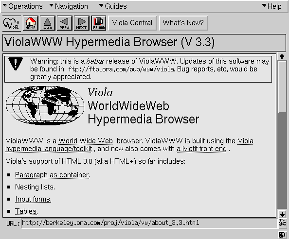

# CSS 诞生史

> 实话说，在过去这一年，这已经成为我好心情的固定来源。即不断地告诉一波波想要像在 TeX、Microsoft Word 等常见的文档处理工具中那样方便地控制 HTML 文档的样式的人们说——安全带系好， 受伤别怪我：“很不好意思，你完蛋了！” —— 马克·安德森 [1994年](http://1997.webhistory.org/www.lists/www-talk.1994q1/0648.html)

在1991年，蒂姆·伯纳斯·李首次提出 HTML 的时候，并没有给页面添加样式的方法。给定的 HTML 该如何渲染决定于浏览器本身，常常还受到用户偏好输入的影响。然而，这看起来确实是一个不错的想法，为网页创建标准，用户可以提供“建议”该以什么样的风格渲染页面。

但要知道五年后才有 CSS，十年后 CSS 才获得全面的实现。因此这是一个群雄逐鹿的时代，很多多热心的工作和变革，产生了多个互相竞争的样式方案，看上去很有可能成为标准。

尽管这些语言在今天并没有用起来，但是我发现思考彼时的未来会变成什么样子真的很有奇妙。更让人惊讶的是，碰巧这些可能成为 CSS 的语言包含的一些特性正是如今开发者希望出现在 CSS 中的。

## 第一个提案

1993年年初，Mosaic 还没有发布 1.0，当时其他已有的浏览器还在搞怎么处理 HTML。并没有什么方法可以来给 HTML 添加样式。总之就是，`<h1>`的样式完全取决于浏览器。

在这年的6月，Robert Raisch 在`www-talk`的邮件列表中给出了一个[提案](http://1997.webhistory.org/www.lists/www-talk.1993q2/0445.html)，创建了“一个解析容易与 Web 文档一起发布的样式信息的格式”，赐名 RRP。

```css
  @BODY fo(fa=he,si=18)
```

看不懂这段代码也很正常。在没有 gzip，网络传输速度只有 14.4k 的时代，尽力压缩新格式的大小是非常合理的。这段规则的实际上是设置字体（font family -> `fa`）为helvetica（`he`），字号（font size -> `si`）为 18 像素。

这个提案缺少一个有意思的东西就是单位，所有数字对应的单位决定于他们使用的上下文（例如字体的大小都是以像素为单位的）。这可以说明 RRP 设计的目的是作为“一系列指导渲染的指示或者建议的集合”，而不是作为标准。这是值得考虑的，因为同一份样式表必须在 common line mode 浏览器和图形浏览器（例如 \[Lynx]\([https://en.wikipedia.org/wiki/Lynx\_(web\_browser)）都能正常工作，后一种浏览器变得越来越流行。](https://en.wikipedia.org/wiki/Lynx\_\(web\_browser\)%EF%BC%89%E9%83%BD%E8%83%BD%E6%AD%A3%E5%B8%B8%E5%B7%A5%E4%BD%9C%EF%BC%8C%E5%90%8E%E4%B8%80%E7%A7%8D%E6%B5%8F%E8%A7%88%E5%99%A8%E5%8F%98%E5%BE%97%E8%B6%8A%E6%9D%A5%E8%B6%8A%E6%B5%81%E8%A1%8C%E3%80%82)


有趣的是，RRP 包含设置列布局的方式，这个特性直到2011年才引入到 CSS 中。例如，3列每列80单位就是下面这样子：

```css
  @P co(nu=3,wi=80)
```

这解析起来有点困难，但应该没有`white-space: nowrap`难。

值得一提的是，RRP 并不支持如今所用的“层叠”样式表。一个文档同一时刻只能激活一个样式表，这从逻辑上来说是合理的，但是今天看来就有点奇怪了。

马克·安德森（一个曾经最流行的浏览器 Mosaic 的创造者）[知道](http://www.webhistory.org/www.lists/www-talk.1993q4/0266.html) RRP 提案，但是并没有在 Mosaic 中实现它。Mosaic 很快（同时也是遗憾地）就采用了通过 HTML 来定义样式的方案，引入像`<FONT>`和`<CENTER>`这样的标签。

## Viola 以及原始浏览器之战

\>

> > 现在台面上已经有多个样式表的提案，为什么你不选其中一个实现之？只要正确地实现了问题就将得到解决。
>
> 因此，我必须告诉大家，“好了，你需要学习这种语言来撰写你的文档，然后学习另外种语言来来把你的文档定义成你想要的样子。”噢，他们会喜欢这样的。 —— 马克·安德森 [1994](http://1997.webhistory.org/www.lists/www-talk.1994q1/0683.html)

反直觉的是，Mosaic 并不是第一个图形化的浏览器。[ViolaWWW](https://en.wikipedia.org/wiki/ViolaWWW) 要比它还早，Pei-Yuan Wei 起初花了四天时间写出的图形化的浏览器。



Pei-Yuan Wei 创建了一个[样式表语言](http://1997.webhistory.org/www.lists/www-talk.1993q4/0264.html)，支持某种嵌套式的结构，这已经被我们用在了今天的 CSS 之中：

```css
  (BODY fontSize=normal
        BGColor=white
        FGColor=black
    (H1   fontSize=largest
          BGColor=red
          FGColor=white)
  )
```

在上例中，为 body 设置颜色，并给出现在 body 中的 h1 设置样式。PWP 并没有采用重复的选择器来表示层级，而是使用圆括号系统。这让我联想到了想 Stylus 和 SASS 使用的缩进系统，如今这在某些 CSS 开发者中很流行。从这方面来讲，PWP 的语法比 CSS 更好，不过后者已经成为了 Web 的通用语言。

值得一提的是 PWP 还是引用外部样式表方法的提出者，到今天也一直在用：

```markup
  <LINK REL="STYLE" HREF="URL_to_a_stylesheet">
```

遗憾的是，ViolaWWW 只能在 [X Window System](https://en.wikipedia.org/wiki/X\_Window\_System) 下工作，后者只在 Unix 系统上受欢迎。当 Mosaic 移植到到 Windows 后，Viola 就消失不见了。

## Web 之前的样式表

> 只有计算机科学家才能接受 HTML 这种东西。它确实可以表达一个文档的内在结构，但一个文档不只包含文本数据的结构。它们需要有视觉的冲击力。HTML 完全抹杀了文档设计者本应该有的视觉创造力。—— Roy Smith [1993](http://1997.webhistory.org/www.lists/www-talk.1993q3/0238.html)

实时上，对定义文档样式语言的需求早在互联网出现之前就有了。

你要知道 HTML 也是基于一种互联网之前就存在的语言 SGML 制定的。早在1987年，美国国防部就决定调研 SGML 是否可以简化文档的存储和传输，他们有大量的文档需要处理。与其他好的政府项目一样，没有时间浪费在起一个好听的名字上。这个小组名字一开始叫做 Computer-Aided Logistics Support（计算机辅助后勤支持），后来更名为 Computer-aided Acquisition and Logistics Support（计算机辅助采集和后勤支持），最后是 Continuous Acquisition and Life-cycle Support（持续采办与全寿命支持计划）。总之首字母缩写就是 CALS。

CALS 团队创造了一门语言来定义 SGML 文档的样式，名为 FOSI，毫无疑问也是某四个单词的缩写。他们发布了一份[语言规范](http://people.opera.com/howcome/2006/phd/archive/www.dt.navy.mil/tot-shi-sys/tec-inf-sys/cal-std/doc/28001C.pdf)，尽管全面，但理解不难。

互联网一个不变的铁律就是：在你能证明某人错误之前必须做更多的事情。1993年，在 Pei-Yuan 给出提案的第四天，Steven Heaney [提出](http://1997.webhistory.org/www.lists/www-talk.1993q4/0295.html)使用 FOSI 一个变体来定义 Web 的样式，他并没有“重新发明轮子”。

FOSI 文档直接就用 SGML 写成，这对于熟悉 SGML 变体 HTML 的 Web 开发者来说有一种逻辑上的转换。文档示例：

```markup
  <outspec>
    <docdesc>
      <charlist>
        <font size="12pt" bckcol="white" fontcol="black">
      </charlist>
    </docdesc>
    <e-i-c gi="h1">\<font size="24pt" bckcol="red", fontcol="white"\></e-i-c>
    <e-i-c gi="h2">\<font size="20pt" bckcol="red", fgcol="white"\></e-i-c>
    <e-i-c gi="a"><font fgcol="red"></e-i-c>
    <e-i-c gi="cmd kbd screen listing example"><font style="monoser"></e-i-c>
  </outspec>
```

你搞不清楚`docdesc`和`charlist`是什么意思对吧？`www-talk`成员也搞不清楚。唯一可以给出上下文信息的只有e-i-c，即“element in context”。FOSI 值得傲娇的是引入了 em 作为字体的单位，现在已经作为熟悉 CSS 的开发者的首选方式。

语言之间的战争就如语言本身一样古老。当时正值“lisp-style”函数式语言与申明式语言的战争。Pei-Yuan 把自己的语法[描述](http://1997.webhistory.org/www.lists/www-talk.1993q4/0297.html)为是“LISP式的”，但这只是时间的问题，LISP 真正的变种语言马上就要出现了。

## 图灵完备的样式表

受累于复杂性，FOSI 被看做是解决文档格式问题的[临时过度方案](http://xml.coverpages.org/kennDSSSLInt.html)。长远的方案是基于函数式语言 Scheme 创建一门新的语言，基于强大的能力，能对文档进行任何你可以想到的转换。这门语言叫做 DSSSL。用贡献者 Jon Bosak 的话来讲：

> 把 DSSSL 和脚本语言放在一起是一种错误。没错，DSSSL 是图灵完备的，它确实是一枚编程语言。但是脚本语言（至少我是这么叫的）是程序化的；DSSSL 则完全不一样。它完全就是函数式的，完全没有副作用。在 DSSSL 样式表没有任何影响，样式表是一个巨大的函数，它的价值是一个抽象的，与设备无关的，非过程化的，对文档格式的描述，作为一种规范（也可称其为申明）送到显示区域逐级渲染过程中。

得益于它的简洁，DSSSL 实际上是一种很容易理解的样式语言：

```css
  (element H1
    (make paragraph
      font-size: 14pt
      font-weight: 'bold))
```

同时作为编程语言，你甚至可以定义函数：

```css
  (define (create-heading heading-font-size)
    (make paragraph
      font-size: heading-font-size
      font-weight: 'bold))

  (element h1 (create-heading 24pt))
  (element h2 (create-heading 18pt))
```

还可以在样式中使用计算，比如定义一个黑白相间的表格：

```css
  (element TR
    (if (= (modulo (child-number) 2)
          0)
      …   ;even-row
      …)) ;odd-row
```

最后还有让你嫉妒心爆棚的特性，DSSSL 甚至可以把继承的属性值作为变量，在上面进行计算。

```css
  (element H1
    (make paragraph
      font-size: (+ 4pt (inherited-font-size))))
```

不幸的是，DSSSL 同时具备了所有 Scheme 类语言的致命弱点：括号太多了。更糟糕的是，规范最终发布时，认为其太过复杂的声音不绝于耳，这让浏览器开发者感到胆怯。DSSSL 标准包含了超过210项独立的样式属性。

这个团队继续创建了 [XSL](https://en.wikipedia.org/wiki/XSL)，用来定义文档的转化，虽然依然让人困惑，但是确实更流行一些。

## 为什么样式表达到了终点

CSS 并没有包含父选择符（一种用来定义包含特定子节点的节点样式定义方法）。这个问题[在 Stack Overflow 上频繁地被问到](http://stackoverflow.com/questions/45004/complex-css-selector-for-parent-of-active-child?lq=1)，但事实证明这个特性的缺失事出有因。尤其在互联网的早期，有一个重要的观点被普遍认可，在文档被完全加载之前，页面必须是可渲染的。换句话说，大家希望在构成页面底部的 HTML 全部加载完成之前，就可以渲染页面起始的 HTML。

一个父选择器意味着随着 HTML 文档的加载样式可能会有变化。像 DSSSL 这样的语言，如果被完全实现，因为它们自己可以操作文档，所以在开始渲染时，页面很可能是不可用的。

第一个贡献者 Bert Bos，在1995年3月[提出](http://people.opera.com/howcome/2006/phd/archive/odur.let.rug.nl/\~bert/stylesheets.html)了这个问题，并给出了一个工作良好的语言，他的提议中包含了“smiley”表情 :-) 的一个早期版本。

这枚语言一定程度上来说是“面向对象的”：

```css
  *LI.prebreak: 0.5
  *LI.postbreak: 0.5
  *OL.LI.label: 1
  *OL*OL.LI.label: A
```

使用`.`来指定直接子节点，使用`*`来指定祖先节点。

他的语言里还有很酷的属性，可以在样式表中定义像超链接这样的特性：

```css
  *A.anchor: !HREF
```

在上例中，把超链接的`HREF`属性设置为它的目的地址。像这种可以在样式表中控制元素的行为的想法在多个提案中非常流行。在还没有 JavaScript 出现的日子里，并没有什么可以控制元素的方法，因此这些新的提案看上去是合理的。

其中一个函数式的[提案](http://people.opera.com/howcome/2006/phd/archive/tigger.cc.uic.edu/\~cmsmcq/style-primitives.html)，也同样包含类似的行为。这个提案由名为 C.M. Sperberg-McQueen 的绅士提出：

```css
  (style a
    (block #f)     ; format as inline phrase
    (color blue)   ; in blue if you’ve got it
    (click (follow (attval 'href)))  ; and on click, follow url
```

他的语言同时还引入了`content`关键字，提供了一种在样式表中控制 HTML 元素内容的方法。在 CSS 2.1 中也引入了这个概念。

## 最大的可能

在我开讲 CSS 语言前身之前，还有另外一个语言值得一提，全都是因为它从某种程度上来说，是早期 Web 开发者梦寐以求的东西。

它就是 PSL96，按照当年的命名约定，1996年版的“Presentation Specification Language”，从核心上看，PSL 与 CSS 很像。

```css
  H1 {
    fontSize: 20;
  }
```

而且它马上变得更有趣了。例如，你不但可以基于元素所设置的尺寸（`Width`）来设置其位置，也可以基于浏览器渲染后的真实尺寸（`Actual Width`）：

```css
  LI {
    VertPos: Top = LeftSib . Actual Bottom;
  }
```

注意你甚至可以使用元素的左邻右舍作为约束条件。

你还可以在样式中使用逻辑表达式。例如，只对有`href`属性的超链接应用样式：

```css
  A {
    if (getAttribute(self, "href") != "") then
      fgColor = "blue";
      underlineNumber = 1;
    endif
  }
```

这种样式可以扩展实现全部今天我们用样式类做的事情。

```css
  LI {
    if (ChildNum(Self) == round(NumChildren(Parent) / 2 + 1)) then
      VertPos: Top = Parent.Top;
      HorizPos: Left = LeftSib.Left + Self.Width;
    else
      VertPos: Top = LeftSib.Actual Bottom;
      HorizPos: Left = LeftSib.Left;
    endif
  }
```

支持如此的功能或许真的可以实现完美拆分内容和样式的代码。遗憾的是这门语言让人望而生畏，毕竟太易于扩展了。这意味着对于不同的浏览器很可能实现会很不一样。而且，它以学术界中的数篇论文发表出现，并没有 www-talk 邮件列表上进行研讨，要知道大部分的工作都是在这邮件列表里确定的。因此这门语言并没有被集成到主流的浏览器中。

## CSS 的元魂

有一门语言，直接引出了 CSS，至少从名字上是这样，它的名字是 CHSS（Cascading HTML Style Sheets），于1994年由 Håkon W Lie [提出](http://people.opera.com/howcome/2006/phd/archive/www.w3.org/People/howcome/p/cascade.html)。

与很多优秀的点子一样，这个提案的原始版本看上很疯狂。

```css
  h1.font.size = 24pt 100%
  h2.font.size = 20pt 40%
```

注意在行尾的百分比，表示当前这个样式表对这个值有多大的权重。例如，如果之前的样式表定义`h2`的字体大小为`30pt`，有`60%`的权重，而加上这个样式表`h2` `20px`的`40%`，根据权重将这两个值合到一起大概就是`26pt`。

在基于文档的 HTML 页面的年代里，可以想象该提案的结果了，毕竟妥协的设计是没法在我们面向应用的世界里工作的。不过，它已经具备了最根基的思想——样式表是可以叠加的。换句话说，在它的眼里同一个页面可以同时应用多个样式表。

这初步的构想被认为是很重要的，是因为为用户提供了一种可以控制文档展现的方法。页面自己有一个样式表，Web 用户也可能有自己的样式表，这两个样式表一起影响页面的渲染。支持多个样式表被看做是维护了 Web 的个人自由，并不是提供的一种方式给开发者（他们仍然手工地编写单独的 HTML）。

用户可以控制给到页面作者建议样式多少权重，就如提案中的一个 ASCII 图表表示的那样：

```
    User             Author
Font   o——x———————o 64%
Color  o-x—————————o 90%
Margin o——————x———o 37%
Volume o————x—————o 50%
```

和其他提案相似的，它所包含的一些特性并没有带到 CSS 中，至少十多年来都没有。例如，这个提案中允许基于用户的环境编写表达式：

```css
  AGE \> 3d ? background.color = pale\_yellow : background.color = white
  DISPLAY\_HEIGHT \> 30cm ? http://NYT.com/style : http://LeMonde.fr/style
```

如未来科幻描述的那样，浏览器很可能知道内容的中的哪些部分与你更相关，于是可以针对你显示更大的字体：

```css
  RELEVANCE \> 80 ? h1.font.size \*= 1.5
```

## 接下来就是你所知的 CSS

> Microsoft 对开源标准的贡献是绝对的，尤其是在互联网领域。—— John Ludeman 1994

Håkon Lie 简化他的提案，并与 Bert Bos 合作，在1996年11月发布了 CSS 规范的第一版。最终他把 CSS 的诞生写入到了自己的博士论文中，也就是[这个文档](http://people.opera.com/howcome/2006/phd/)帮助我写下了这篇文章。

与其他提案相比，CSS 最值的一提的就是它的简单。它易于解析、编写和阅读。这种例子在互联网的历史里屡见不鲜。最终取胜的技术是那些初学者容易入门的，而不是那些给专家用的。

这波变革具有很大的偶然性，CSS 就可以作为一个活生生的例子。例如，只有上下文选择器（`body ol li`）得以支持，因为 Netscape 已经有方法可以移除超链接内图片的边框，而且看上去实现有所主流浏览器的功能更重要些。这个功能本身就大大拖延了 CSS 的实现，毕竟那个时候大部分浏览器在解析 HTML 的时候都不会把 tag 保存成一个栈。因此解析器需要重新设计才能完整的支持 CSS。

有如此的挑战（外加非标准标签定义样式被大量使用）导致1997年以前 CSS 都没法用。直到2000年3月才有浏览器完整支持它。每个工程师都会告诉你，直到最近几年浏览器的实现才真正与标准保持一致，这里 CSS 首次发布已经过去超过15年。

## 终极大 Boss

> 如果 Netscape 4 忽略在  上的 CSS 规则，然后在每个结构化的元素之前添加随机数量的空格；如果 IE4 正确处理了 ，但 padding 上却全是问题。那写什么样的 CSS 才是安全的？有的开发者直接选择完全不用 CSS，还有的可能就为 IE4 写一个样式表，再为 Netscape 4 写一个，以弥补后者犯的错。 — Jeffrey Zeldman

Internet Explorer 3 以发布时带着对 CSS 的支持（有可能有点糟糕）而闻名遐迩。为了与之竞争，网景公司决定 Netscape 4 也应该支持这门语言。与其把宝压在第三方语言上，考虑到 HTML 和 JavaScript，决定实现方案应该是将 CSS 转化为 JavaScript 执行。而且，确定 Web [开发者也可以访问](https://web.archive.org/web/19970709133056/http://home.netscape.com/comprod/products/communicator/guide.html)这个“JavaScript 样式表“中间语言。

语法直接使用 JavaScript，然后增加一些样式相关的 API：

```javascript
  tags.H1.color = "blue";
  tags.p.fontSize = "14pt";
  with (tags.H3) {
    color = "green";
  }

  classes.punk.all.color = "#00FF00"
  ids.z098y.letterSpacing = "0.3em"
```

你甚至可以定义函数，每次解析到对应的标签时就会执行一次该函数：

```javascript
  evaluate\_style() {
    if (color == "red"){
      fontStyle = "italic";
    } else {
      fontWeight = "bold";
    }
  }

  tag.UL.apply = evaluate\_style();
```

我们应该简化样式和脚本之间的分界线无疑是合理的，在如今的 [React 社区](https://facebook.github.io/react/tips/inline-styles.html)这种观点又开始复现了。

当时，JavaScript 自己虽然是一门比较新的语言，但通过一些反向工程，Internet Explorer 已经在 IE3 中以 JScript 的方式支持它了。更大的问题在于社区已经团结在 CSS 周围了，而且，彼时的 Netscape 已经被标准社区视作[小霸王](https://lists.w3.org/Archives/Public/www-style/1996Jun/0068.html)，当它向标准委员会[提交](https://www.w3.org/Submission/1996/1/WD-jsss-960822) JSSS 时，委员会充耳不闻。三年后，Netscape 6 也放弃了对 JSSS 的支持，而且自己也差不多要安乐死了。

## 最大的可能

鉴于 W3C 引起的一些[舆论压力](https://www.w3.org/Style/CSS/Test/CSS1/current/)，2000年 Internet Explorer 5.5 发布，几乎完全支持 CSS1。当然，如大家所知，浏览器 CSS 的实现 Bug 无限多，十年以来都很难用。今天现状已经有了戏剧性的改善，真正实现了开发者的梦想，编写一次代码，有信心代码可以在浏览器之间一样地工作。

看了这么多，我个人的结论就是，无论这些决定是武断还是有理有据的，都决定着我们目前的工具是什么样子的。如果 CSS 当时的设计只是为了满足1996年的需求，那可以肯定的是，20年后的今天我们做事情的方式至少是有些不一样的。

## 参考文献

[http://qianduan.guru/2016/07/26/The-Languages-Which-Almost-Became-CSS/](http://qianduan.guru/2016/07/26/The-Languages-Which-Almost-Became-CSS/) [https://eager.io/blog/the-languages-which-almost-were-css/](https://eager.io/blog/the-languages-which-almost-were-css/)
