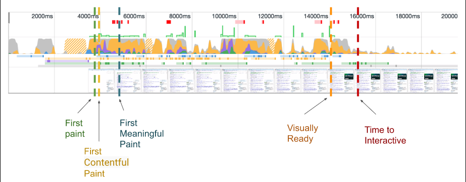

# Performance of First Screen

## 首屏过程


浏览器执行的阶段：

重定向 -&gt; 拉取缓存 -&gt; DNS 查询 -&gt; 建立 TCP 连接 -&gt; 发起请求 -&gt; 接收响应 -&gt; 处理 HTML 元素 -&gt; 元素加载完成

## 指标定义

基于用户感受的分类：

### 是否正在打开页面？\(Visual metrics\)

* 首次绘制\(FP=First Paint\)
* **首次有内容绘制\(FCP=First Contentful Paint\)** 定义：以下任一个首次加载的时间戳
  * 文字
  * SVG
  * 图片
  * 背景图
  * canvas

### 加载的内容是有用的么？\(Interactive\)

* **首次有意义绘制\(FMP=First Meaningful Paint\)**  
  定义：主要内容绘制完成

  * 头部及其文字
  * 搜索引擎关键词
  * 电商网站的图片

  不作数的：

  * loading 态
  * FOUC\(A flash of unstyled content\)
  * 只渲染了导航或头部

* **Hero Element Timing** 定义：大尺寸的元素绘制完成

### 是可用的么？\(是否能够操作页面了\)

* 视觉准备\(Visual Ready\)
* **首次可交互时间\(TTI=Time To Interactive\)** 定义：
  * FMP 已完成
  * 85%的视觉完备
  * DOMContentLoaded 被触发
* **首次输入延迟\(FID=First Input Delay\)** 定义：从用户首次产生交互到浏览器实际给出反馈的延迟时间

### 是否足够轻量？

* bundle 体积
* CPU 耗时（Long Tasks）

指标示意图：




### RAIL 模型




## 计算方法

### 追踪 FP/FCP

```javascript
const observer = new PerformanceObserver((list) => {
  for (const entry of list.getEntries()) {
    // `name` will be either 'first-paint' or 'first-contentful-paint'.
    const metricName = entry.name;
    const time = Math.round(entry.startTime + entry.duration);
  }
});
observer.observe({entryTypes: ['paint']});
```


必须确保 PerformanceObserver 注册在 &lt;head&gt; 元素且位于任何样式表的前面，这样才会在 FP/FCP 时触发。

在 Performance Observer spec Level 2 实现就不必如此了，因为它提供了 buffered 标记，允许访问 PerformanceObserver 创建之前的数据。


### 利用 hero 元素追踪 FMP

对于 FMP 没有一个标准化的定义。

可以利用 mark 和 measure 标记，来追踪 FMP。

```javascript
function fetchData() {
  performance.clearMarks("start update");
  performance.mark("start update");
  // Do an XHR or JSON request that calls updateData() with the new data.
}
function updateData(data) {
  // Update the DOM with the new data.
  performance.clearMarks("finish update");
  performance.mark("finish update");
  perforance.measure("update data", "start update", "finish update");
}
```

### 追踪 TTI

Chrome 提供的 [https://github.com/GoogleChromeLabs/tti-polyfill](https://github.com/GoogleChromeLabs/tti-polyfill) 是基于浏览器提供的 Long Task API 的。

```javascript
import ttiPolyfill from './path/to/tti-polyfill.js';
ttiPolyfill.getFirstConsistentlyInteractive().then((tti) => {
});
```


TTI 和 FMP 一样是个难以标准化的指标，在使用 polyfill 之前要在页面多进行测试。TTI 定义和实现的更多细节：[https://docs.google.com/document/d/1GGiI9-7KeY3TPqS3YT271upUVimo-XiL5mwWorDUD4c/preview\#](https://docs.google.com/document/d/1GGiI9-7KeY3TPqS3YT271upUVimo-XiL5mwWorDUD4c/preview#)


### 追踪长任务

```javascript
const observer = new PerformanceObserver((list) => {
  for (const entry of list.getEntries()) {
  }
});
observer.observe({entryTypes: ['longtask']});
```


## 收集方法

### 实际用户数据\(RUM=Real User Measurements\)

局限：

* performance API 聚焦在技术指标，但我们更关心用户实际体验
* 用户实际体验因素过于复杂，很难区分具体受哪一因素影响
* 噪声数据较多，需要统计技巧

### 实验环境数据\(synthetic testing\)

* 更可控的测试环境\(网络、操作系统、浏览器版本、CPU 等等\)，提供更精准的数据
* 与 RUM 相辅相成

## 优化分析

#### 拉取缓存

浏览器缓存策略：


一些指标


改进策略


## 参考文献

*  [https://phabricator.wikimedia.org/phame/live/7/post/117/performance\_testing\_in\_a\_controlled\_lab\_environment\_-\_the\_metrics/](https://phabricator.wikimedia.org/phame/live/7/post/117/performance_testing_in_a_controlled_lab_environment_-_the_metrics/) 指标定义相关
* ​

